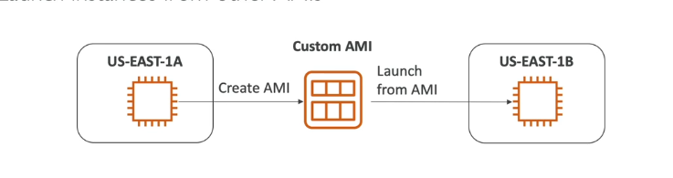
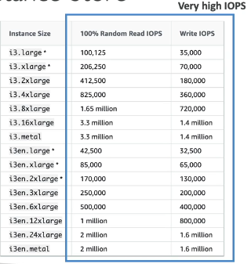
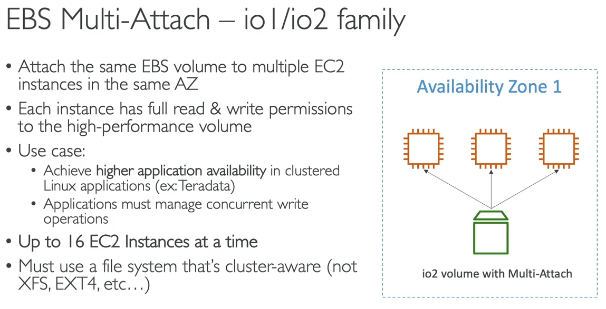
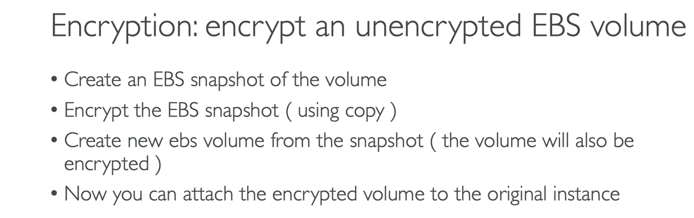
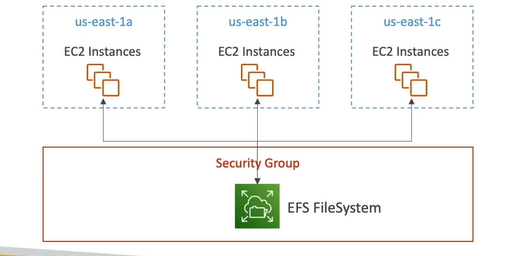

#### Ec2 service
+ Ec2 is one of the most popular of AWS' offering
+ Ec2= Elastic compute cloud = Infrastructure as a Service
+ It mainly consists in the capability of :
  * Renting virual machines (Ec2)
  * Storing data on virtual drives (EBS)
  * Distributing load across machines (ELB)
  * Scaling the services using an auto-scaling group(ASG)
+ Knowing Ec2 is fundamental to understand how the Cloud works

##### Ec2 sizing & configuration options
+ Operating System (OS): Linux,Windows or Mac OS
+ How much compute power & cores (CPU)
+ How much random-access memory (RAM)
+ How much storage space:
 * Network-attached (EBS & EFS)
 * hardware (EC2 Instance Store)
+ Network card: Speed of the card,Public IP address
+ Firewall rules: security group
+ Bootstrap script (Configure at first lunch):Ec2 User Data

#### Ec2 User Data
+ It is possible to bootstrap our instances using an EC2 User data script.
+ bootstrapping means lunching commands when a machine starts
+ That script is only run once at the instance first start
+ EC2 user data is used to automate boot tasks such as :
 * Installing updates
 * Installing software
 * Downloading common files from the internet
 * Anything you can think of
+ The EC2 User Data Script runs with the root user

#### EC2 Instance types expampes
 

 I have to learn 
 + Private IPv4 addresses
 + Public IPv4 address
 + VPC,Subnet,Security groups

 https://aws.amazon.com/ec2/instance-types/
 
##### AWS has the following naming convention:
m5.2xlarge means
+ m:instance class
+ 5:generation (AWS improves them over time)
+ 2xlarge:size within the instance class

  
  Ec2 instance info
  https://instances.vantage.sh/

#### Introduction to Security Groups
 + Security Groups are the fundamental of network security in AWS
 + They control how traffic is allowed into or out of our EC2 instance.
 + Security groups only contain allow rules
 + Security groups rules can reference by IP or by security group
 
#### Security Groups Depper Dive
 + Security groups are action as a "Firewall" on EC2 instances
 + The regulate:
  * Access to Ports
  * Authorised Ip ranges - IPv4 and IPv6
  * Control of inbound network (from other to the instance)
  * Control of outbound network (from the instance to other)
    
| Type               | Protocal  | Port Range  | Source                   | Description               | 
| ------------------ | --------- | ----------- | ------------------------ | -----------               |
| HTTP               | TCP       | 80          | 0.0.0.0/0                | test http page            |
| SSH                | TCP       | 22          | 122.149.198.85/32        |                           |
| Custom TCP Rule    | TCP       | 4567        | 0.0.0.0/0                | java app                  |

 
#### Security Groups good to know
 + Can be attached to multiple instances
 + Locked down to a region / VPC combination
 + Does live "Outside" the EC2 - if traffic is blocked the EC2 instance won't see it
 + It's goog to maintain one separate security group for SSH access
 + If your application is not accessible (time out), then it's a security group issue
 + if your application gives a "connection refused" error, then it's an application error or it's not launched
 + All inbound traffic is blocked by default
 + All outbound traffic is authorised by default
#### Refencing othersecurity groups Diagram

##### Classic Ports to know
 + 22 = SSH (Secure Shell) - log into a Linux instance
 + 21 = FTP (File Transfer Protocol) - upload files into a file share
 + 22 = SFTP (Secure File Transfer Protocol) upload fiels using SSH
 + 80 = HTTP - access unsecured websites
 + 443 = HTTPS - access secured websites
 + 3389 = RDP (Remote Desktop Protocol) - log into a Windows instance

 https://test-ipv6.com/

 #### AMI Overview
 + AMI= Amazon Machine Image
 + AMI are a customization of an EC2 instance
   * You add your own software,configuration,operating system,monitoring...
   * Faster boot / configuration time because all your software is pre-packaged
 + AMI are built for a specific region (and can be copied across regions)
 + You can lunch EC2 instances from:
   * A Public AMI:AWS provided
   * Your own AMI: you make and maintain tem yourself
   * An AWS Marketplace AMI: an AMI someone else made (and potentially sells)

#### AMI Process (from an EC2 instance)
  + Start an EC2 instance and customize it
  + Stop the  instance (for data integrity)
  + Build an AMI - this will also create EBS snapshots
  + Launch instances from other AMIs
    

#### EC2 Instance Storre
 + EBS vloumes are network drives with good but "limited" performance
 + If you need a high-performance hardware disk, use EC2 Instance Store
 + Better I/O performance
 + EC2 Instance Store lose their storage if they're stopped (ephemeral)
 + Good for buffer / cache / scratch data / temporary content
 + Risk of data loss if hardware fails
 + Backups and Replication are your responsibility
#### Local EC2 Instance Store
 

#### EBS Volume Types
 + EBs Volumes come in 6 types
   * gp2 / gp3 (SSD): General purpose SSD volume that balances price and performance for a wide variety of workloads
   * io | / io2 Block Express (SSD): Highest-performance SSD volume for mission-critical low-latency or high-troughput workloads
   * st | (HDD): Low cost HDD volume designed for frequently accessed,throughput-intensive workloads
   * sc | (HDD): Lowest cost HDD volume designed for less frequently accessed workloads
  + EBS Volumes are characterized in Size | Throughput | IOPS (I/O Ops Per Sec)
  + When in doubt always consult the AWS documentation - it's good!
  + Onlu gp2/gp3 and io1 / io2 Block Express can be used as boot volumes
#### EBS Volume Types Use cases
#### General Purpose SSD
  + Cost effective storage,low-latency
  + System boot volmes,Virtual desktops,Development and test environments
  + 1 GiB - 16 TiB
  + gp3:
    * Baseline of 3,000 IOPS and throughput of 125 MiB/s
    * Can increase IOPS up to 16,000 and throughput up to 1000 MiB/s independently
  + gp2:
    * Small gp2 volumes can burst IOPS to 3,000
    * Size of the volume and IOPS are linked,  max IOPS is 16,000
    * 3 IOPS per GB,means at 5,334 GB we are at the max IOPS
#### Provisioned IOPS (PIOPS) SSD
  + Critical business applications with sustained IOPS performance
  + Or applications that need more than 16,000 IOPS
  + Great for databases workloads (sensitive to storage perf and consistency)
  + io | (4 GiB - 16 TiB)
    * Max PIOPS : 64,000 for Nitro EC2 instances & 32,000 for other
    * Can increase PIOPS independently from storage size
  + io2 Block Express (4 GiB - 64 TiB):
    * Sub-millisecond latency
    * Max PIOPS:256,000 with an IOPS:GiB raio of 1,000:1
    * Suports EBS Multi-attach

#### Hard Disk Drives (HDD)
  + Can not be a boot volume
  + 125 GiB to 16 TiB
  + Throughput Optimized HDD (st1)
    * Big Data,Data Warehouse,Log Processing
    * Max throughput 500 MiB/s max IOPS 500
  + Cold HDD (sc1)
    * For data that is infrequently accessed
    * Scenarios where lowest cost is important
    * Max throughput 250 MiB/s - max IOPS 250 

https://aws.amazon.com/ebs/volume-types/#ssd-based-volumes--11s368y

#### Amazon EFS - Elastic File System
 + Manage NFS (network file system) that can be mounted on many EC2
 + EFS works with EC2  instances in multi-AZ
 + Highly available,scalable,expensive (3X gp2),pay per use

 + Use cases: content management,web serving,data sharing,Wordpress
 + Uses NFSv4, 1 protocal
 + Uses security group to control access to EFS
 + Compatible with Linux based AMI (not Windows)
 + Encription at rest using KMS
 + POSIX file system (~Linux) that has a standard file API
 + File system scales automatically,pay-per-use,no capacity planning!

