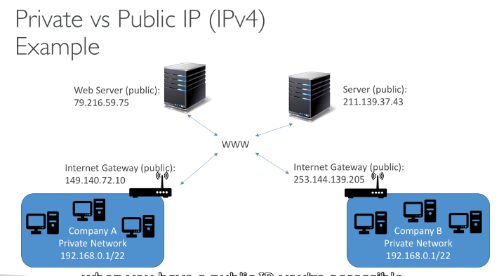
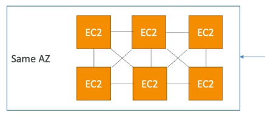
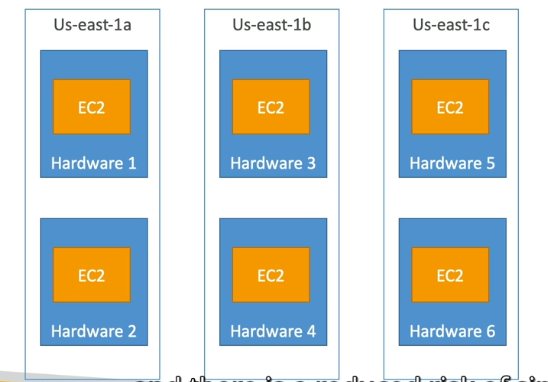
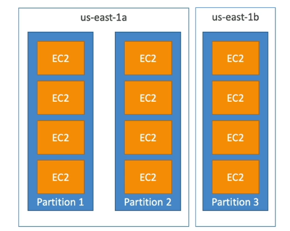
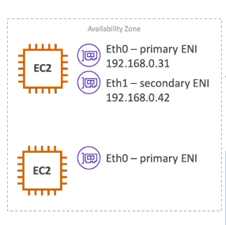
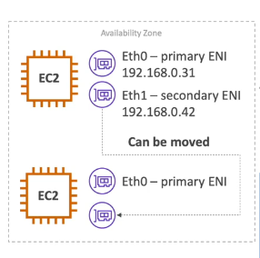

#### Private Vs Public IP(IPv4)
+ Networking has two sorts of IPs. IPv4 and Ipv6
  * IPv4: 1.160.10.240
  * IPv6: 3ffe:1900:4545:3:200:f8ff:fe21:67cf
+ In this course ,we will only be using IPv4.
+ IPv4 is still the most common format used online. 
+ IPv6 is newer and solves problems for the Internet of Thinks(IoT).
+ IPv4 allows for 3.7 billion different address in the public space.
+ IPv4:[0-255].[0-255].[0-255].[0-255].

#### Private Vs Public IP (IPv4)
+ Public IP:
  * Public IP means the machine can be identified on the internet
  * Must be unique across the whole web (not two machines can have the same public IP).
  * Can be geo-located easily.
+ Private IP:
  * Private IP means the machine can only be identified on a private network only
  * The IP must be unique across the private network
  * But two diffrent private networks (tow companies) can have the same IPs.
  * Machines connect to WWW using an internet getway (a proxy)
  * Only a specified range of IPs can be used as private IP
#### Elastic Ips
 + When you stop and then start an EC2 instance,it can change its public IP.
 + If you need to have a fixed public IP for your instance,you need an Elastic IP
 + An Elastic IP is a public IPv4 IP you own as long as you don't delete it.
 + You can attach it to one isntance at a time
 + With and Elastic IP address, You can mask the failure of and instance or software by rapidlyremapping the address to another instance in your account
 + You can only have 5 Elastic IP in your account (you can ask AWS to increase that).
 + Overall,try to avoid using Elastic IP:
   * The often reflect poor architectural decisions
   * Instead, use a random public IP and register a DNS name to it.
   * Or,as we'll see later,use a Load Blancer and don't use a public IP
#### Private vs Public IP (IPv4) In AWS EC2 - Hands ON
+ By default, your EC2 machine comes with:
  * A private IP for the internal AWS Network 
  * A public IP,for the WWW.
+ When we are donig SSH into our EC2 machines:
 * We can't use a private IP,because we are not in the same network
 * We can only use the public IP.
+ If your machine is stopped and then started, the public IP can change

#### Placement Group
+ Sometimes you want control over the EC2 Instance placement strategy
+ That strategy can be defined using placement groups
+ When you create a placement group,you specify one of the following strategies for the group:
  * Cluster---cluster instances ino a low-latency group in a single Availability Zone
  * Spread ---spreads instances across underlying hardware (max 7 instanes per group per AZ(availability zone)) - citical applicaitions
  * Partition---spreads instances accross many different partitions (Which rely on different sets of racks) within an AZ. Scales to 100s of EC2 instances per group (Hadoop,Cassandra,Kafka)
#### Placement Groups Cluster
  
+ Pros: Great network (10 Gbps bandwidth between instances with Enhanced Networking enabled - recommended)
+ Cons:If the AZ fails, all instances fails at the same time
+ Use case:
  * Big Data job that needs to complete fast
  * Application that needs extremly low latency and high network throughput
#### Placement Groups Spread
 

 + Pros:
   * Can span across Availability Zones (AZ)
   * Reduced risk is simultaneous failure
   * EC2 Instances are on diffrent phycal hardware
+ Cons:
  * Limited to 7 instances per AZ per placement group
+ Use case:
  * Application that needs to maximize high availability
  * Critical Applications where each instance must be isolated from failure from each oher

#### Placements Groups Partition
 
+ Up to 7 partitions per AZ
+ Can span accross multiple AZs in the same region
+ Up to 100s of EC2 instances
+ The instances in a partition do not share racks with the insances in the other partitions
+ A partition failure can affect many EC2 but won't affect other partitions
+ EC2 instances get access to the partition information as metadata
+ Use cases:HDFS,HBase,Cassandra,Kafka

#### Elastic Network Interface(ENI)
+ Logical component in a VPC that represents a virtual network card
+ The ENI can have the following:
  * Primary private IPv4,one or more secondary IPv4
  * One Elastic IP (IPv4) per private IPv4
  * One Public IPv4
  * One or more security groups
  * A MAC address
+ You can create ENI independently and attach them on the fly (move them) on EC2 instances for failover.
+ Bound to a specific availability zone (AZ)

