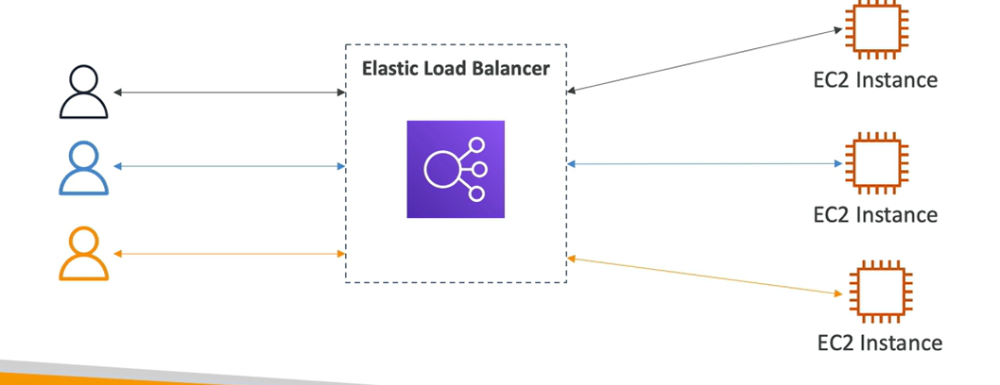
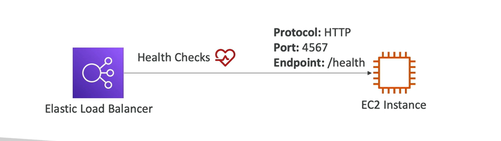
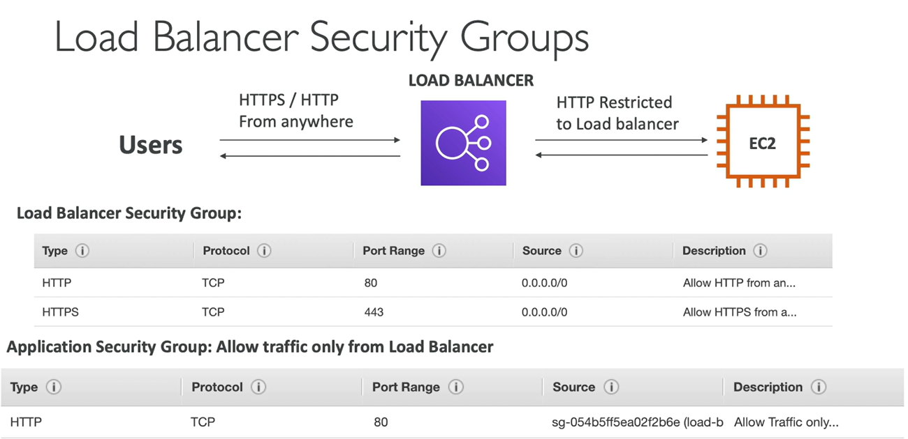
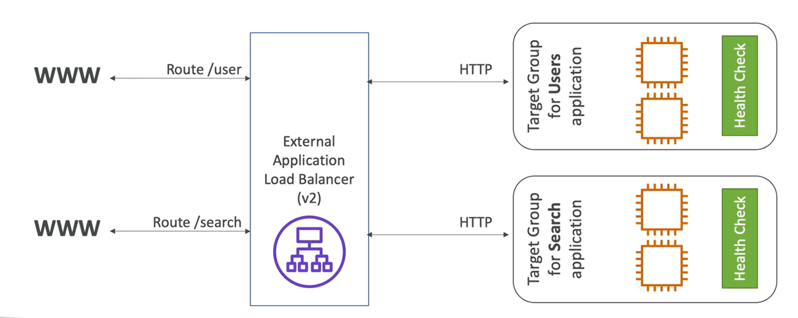
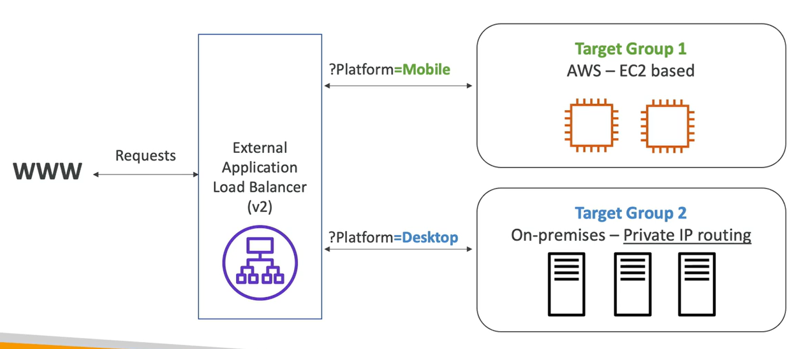
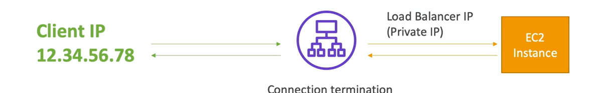

#### What is load balancing?
+ Load Banances are servers that forward traffic to multiple servers (e.g EC2 instances) downstrem
 
#### Why use a load balancer
+ Spread load accross multiple downstream instances
+ Expose a single point of access (DNS) to your application
+ Seamlessly handle failure of downstream instances
+ Do regular halth checks to your instances
+ Provide SSL termination (HTTPS) for your websites
+ Enforce stickiness with cookies
+ High availability across zones
+ Separate public traffic from private traffic
#### Why use an Elastic Load Balancer?
+ AWS guarantees that it will be working
   * AWS gurantees that it will be working 
   * AWS takes care of upgrades,maintenance,high availabilty
   * AWS provides only a few configuration knobs
+ It costs less to setup your own load blances but it will be a loat more effort on your end
+ It is integratted with many AWS offerings / services
  * EC2 ,EC2 Auto Scaling Groups,Amazon ECS
  * AWS Certificate Manager (ACM),CloudWatch
  * Route 53,Aws WAF,AWS Global Accelerator
#### Health Checks
  + Health Checks are crucial for Load Balancers
  + They enable the load balancer to know if instances it forwords traffic to are available to reply to request
  + The health check is done on a port and a route (/health is common)

#### Types of load balancer on AWS
  + AWS has 4 kinds of managed Load Balancers
  + Classic Load Balancdr (v1 -old generation) - 2009 - CLB
  + Application Load Balancer (v2 - new generation) - 2016 - ALB
    * HTTP,HTTPS,WebSocket
  + Network Load Balancer (v2 - new generation) - 2017 -NLB
    * TCP,TLS (secure TCP),UDP
  + Gateway Load Balancer - 2020 - GWLB
    * Operates at layer 3 (Network layer) - IP Protocal
  + Overall, it is recommended to use the newer generatin load balancers as they provide more fetures
  + Some load balancers can be serup as internal (private) or external (public) ELBs

#### Application Load Balancer (v2)
 + Application load balancers is Layer 7 (HTTP)
 + Load balancing to multiple HTTP applications across machines (target groups)
 + Load balancing to multiple applications on the same machine (ex:contaners)
 + Support for HTTP/2 and WebSocket
 + Support redirect (from HTTP to HTTPS for example)
 + Routing tables to different target groups:
   * Routing based on path in URL (example.com/users & example.com/posts)
   * Routing based on hostname in URL (one.example.com & other.example.com)
   * Routing based on Query String, Headers (example.com/users?id=123&order=false)
 + ALB are a great fit for micro services & container-based application (example:Docker & Amaxon ECS)
 + Has a port mapping feature to redirect to a dynamic port in ECS
 + In comparison, we'd need multiple Classic Load Balancer per application

#### Application Load Balancer (v2) HTTP Based Traffic

#### Application Load Balancer (v2) Target Groups
  + EC2 instances (Can be managed by an Auto Scaling Group) - HTTP
  + ECS task (managed by ECS itself) - HTTP
  + Lambda functions - HTTP request is translated into a JSON event 
  + IP Addresses - must be private IPs
  ALB can route to multiple target groups
  + Health checks are at the target group level
#### Application Load Balancer (v2)
#### Query String/Parameters Routing

#### Application Load Balancer (v2)
#### Good to Know
  + Fixed hostname (XXX.region.elb.amazonaws.com)
  + THe application servers don't see the IP of the client directly
    * The true IP of the client is inserted in the header X-Forwarded-For
    * We can also get Post (X-Forwarded-Port) and proto (X-Forwarded-Proto)

