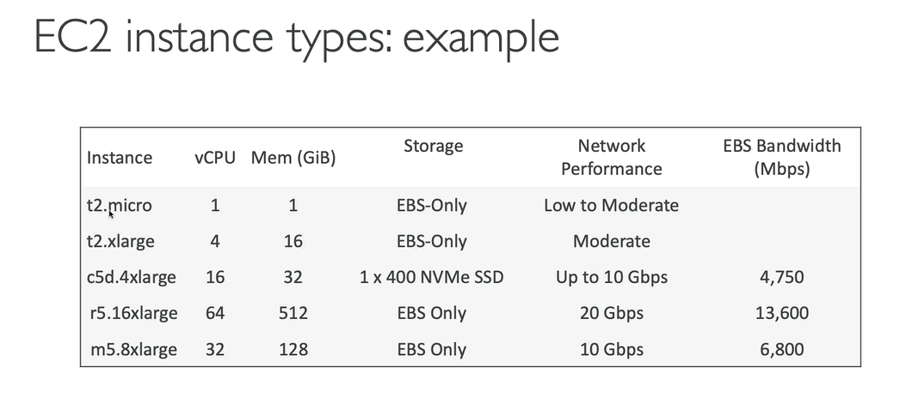
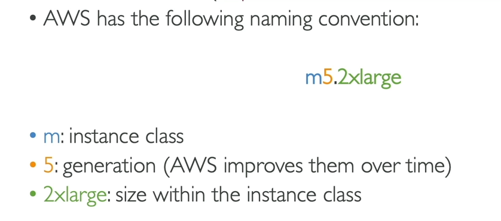
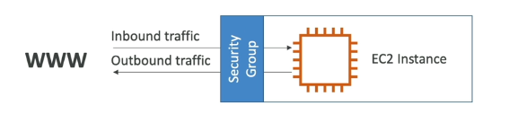

#### Ec2 service
+ Ec2 is one of the most popular of AWS' offering
+ Ec2= Elastic compute cloud = Infrastructure as a Service
+ It mainly consists in the capability of :
  * Renting virual machines (Ec2)
  * Storing data on virtual drives (EBS)
  * Distributing load across machines (ELB)
  * Scaling the services using an auto-scaling group(ASG)
+ Knowing Ec2 is fundamental to understand how the Cloud works

##### Ec2 sizing & configuration options
+ Operating System (OS): Linux,Windows or Mac OS
+ How much compute power & cores (CPU)
+ How much random-access memory (RAM)
+ How much storage space:
 * Network-attached (EBS & EFS)
 * hardware (EC2 Instance Store)
+ Network card: Speed of the card,Public IP address
+ Firewall rules: security group
+ Bootstrap script (Configure at first lunch):Ec2 User Data

#### Ec2 User Data
+ It is possible to bootstrap our instances using an EC2 User data script.
+ bootstrapping means lunching commands when a machine starts
+ That script is only run once at the instance first start
+ EC2 user data is used to automate boot tasks such as :
 * Installing updates
 * Installing software
 * Downloading common files from the internet
 * Anything you can think of
+ The EC2 User Data Script runs with the root user

#### EC2 Instance types expampes
 

 I have to learn 
 + Private IPv4 addresses
 + Public IPv4 address
 + VPC,Subnet,Security groups

 https://aws.amazon.com/ec2/instance-types/
 
##### AWS has the following naming convention:
m5.2xlarge means
+ m:instance class
+ 5:generation (AWS improves them over time)
+ 2xlarge:size within the instance class

  
  Ec2 instance info
  https://instances.vantage.sh/

#### Introduction to Security Groups
 + Security Groups are the fundamental of network security in AWS
 + They control how traffic is allowed into or out of our EC2 instance.
 + Security groups only contain allow rules
 + Security groups rules can reference by IP or by security group
 
#### Security Groups Depper Dive
 + Security groups are action as a "Firewall" on EC2 instances
 + The regulate:
  * Access to Ports
  * Authorised Ip ranges - IPv4 and IPv6
  * Control of inbound network (from other to the instance)
  * Control of outbound network (from the instance to other)
  
 

