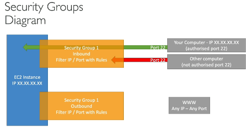
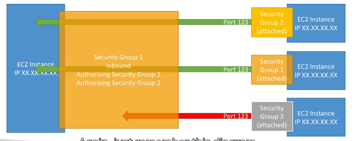

#### Ec2 service
+ Ec2 is one of the most popular of AWS' offering
+ Ec2= Elastic compute cloud = Infrastructure as a Service
+ It mainly consists in the capability of :
  * Renting virual machines (Ec2)
  * Storing data on virtual drives (EBS)
  * Distributing load across machines (ELB)
  * Scaling the services using an auto-scaling group(ASG)
+ Knowing Ec2 is fundamental to understand how the Cloud works

##### Ec2 sizing & configuration options
+ Operating System (OS): Linux,Windows or Mac OS
+ How much compute power & cores (CPU)
+ How much random-access memory (RAM)
+ How much storage space:
 * Network-attached (EBS & EFS)
 * hardware (EC2 Instance Store)
+ Network card: Speed of the card,Public IP address
+ Firewall rules: security group
+ Bootstrap script (Configure at first lunch):Ec2 User Data

#### Ec2 User Data
+ It is possible to bootstrap our instances using an EC2 User data script.
+ bootstrapping means lunching commands when a machine starts
+ That script is only run once at the instance first start
+ EC2 user data is used to automate boot tasks such as :
 * Installing updates
 * Installing software
 * Downloading common files from the internet
 * Anything you can think of
+ The EC2 User Data Script runs with the root user

#### EC2 Instance types expampes
 

 I have to learn 
 + Private IPv4 addresses
 + Public IPv4 address
 + VPC,Subnet,Security groups

 https://aws.amazon.com/ec2/instance-types/
 
##### AWS has the following naming convention:
m5.2xlarge means
+ m:instance class
+ 5:generation (AWS improves them over time)
+ 2xlarge:size within the instance class

  
  Ec2 instance info
  https://instances.vantage.sh/

#### Introduction to Security Groups
 + Security Groups are the fundamental of network security in AWS
 + They control how traffic is allowed into or out of our EC2 instance.
 + Security groups only contain allow rules
 + Security groups rules can reference by IP or by security group
 
#### Security Groups Depper Dive
 + Security groups are action as a "Firewall" on EC2 instances
 + The regulate:
  * Access to Ports
  * Authorised Ip ranges - IPv4 and IPv6
  * Control of inbound network (from other to the instance)
  * Control of outbound network (from the instance to other)
    
| Type               | Protocal  | Port Range  | Source                   | Description               | 
| ------------------ | --------- | ----------- | ------------------------ | -----------               |
| HTTP               | TCP       | 80          | 0.0.0.0/0                | test http page            |
| SSH                | TCP       | 22          | 122.149.198.85/32        |                           |
| Custom TCP Rule    | TCP       | 4567        | 0.0.0.0/0                | java app                  |

 
#### Security Groups good to know
 + Can be attached to multiple instances
 + Locked down to a region / VPC combination
 + Does live "Outside" the EC2 - if traffic is blocked the EC2 instance won't see it
 + It's goog to maintain one separate security group for SSH access
 + If your application is not accessible (time out), then it's a security group issue
 + if your application gives a "connection refused" error, then it's an application error or it's not launched
 + All inbound traffic is blocked by default
 + All outbound traffic is authorised by default
#### Refencing othersecurity groups Diagram

##### Classic Ports to know
 + 22 = SSH (Secure Shell) - log into a Linux instance
 + 21 = FTP (File Transfer Protocol) - upload files into a file share
 + 22 = SFTP (Secure File Transfer Protocol) upload fiels using SSH
 + 80 = HTTP - access unsecured websites
 + 443 = HTTPS - access secured websites
 + 3389 = RDP (Remote Desktop Protocol) - log into a Windows instance

